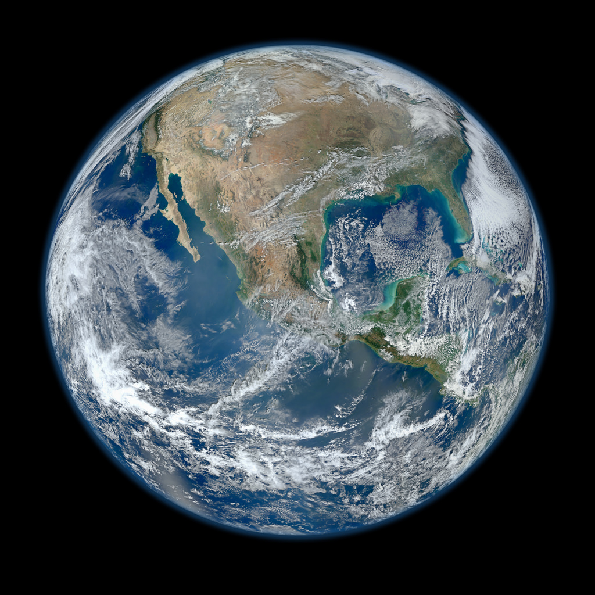
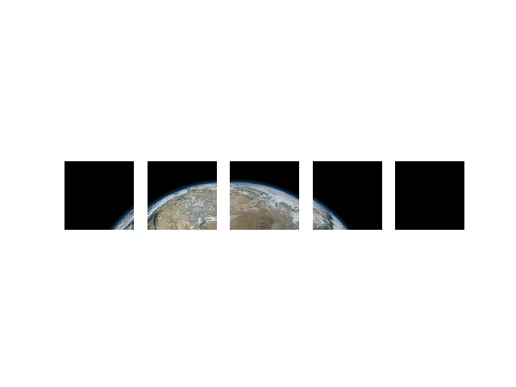

# image-tiler

The purpose of the Image Tiler is to make it easy to go back and forth between tiled versions of an image and stiched version of an image.  image-tiler also allows you to save the tiles to file.

## Quick example

Lets load in an image in an image and try it out.
``` 
from tiledimage import TiledImage
from PIL import Image
PIL_image = Image.open('test_imgs/earth.jpg')
PIL_image.show()
```


Now lets tile the image!
```
tiled_img = TiledImage.createFromImage(PIL_image,244)
print(tiled_img.shape)
# (5,5)
```

When using a TiledImage object to tile an image you only have to specify the size of the tiles that you want.  The number of tiles is calculated behind the scenes. All tiles will have the same size, thus if the image does not tile evenly, the last tile in the row or column will be padded with 0 to make the tile the same size as the rest. Currently only square tiles are supported.

You can also index each tile from where they would be on a grid.  The below code gets the tiles for the first row.
```
import matplotlib.pyplot as plt
firstRow = [ tiled_img[0,i] for i in range(tiled_img.shape[0]) ]
for idx, tile in enumerate(firstRow):
  plt.subplot(1,5,idx+1)
  plt.axis('off')
  plt.imshow(tile)
plt.show()
```



Finally you can save the tiles to file.  They will save in the following format:
{PREFIX}_RR_CC.png where RR is the row index of the image and CC is the column index. 
Here is an example:
```
from glob import glob
img.save('./test_imgs',prefix='Earth_Tiles')
print(glob('./test_imgs/Earth_Tiles*'))
# Output:
# ['./test_imgs/Earth_Tiles_000_000.png',
# './test_imgs/Earth_Tiles_000_001.png',
# './test_imgs/Earth_Tiles_000_002.png',
# './test_imgs/Earth_Tiles_000_003.png',
# './test_imgs/Earth_Tiles_000_004.png',
# './test_imgs/Earth_Tiles_001_000.png',
# './test_imgs/Earth_Tiles_001_001.png',
# './test_imgs/Earth_Tiles_001_002.png',
# './test_imgs/Earth_Tiles_001_003.png',
# './test_imgs/Earth_Tiles_001_004.png',
# './test_imgs/Earth_Tiles_002_000.png',
# './test_imgs/Earth_Tiles_002_001.png',
# './test_imgs/Earth_Tiles_002_002.png',
# './test_imgs/Earth_Tiles_002_003.png',
# './test_imgs/Earth_Tiles_002_004.png',
# './test_imgs/Earth_Tiles_003_000.png',
# './test_imgs/Earth_Tiles_003_001.png',
# './test_imgs/Earth_Tiles_003_002.png',
# './test_imgs/Earth_Tiles_003_003.png',
# './test_imgs/Earth_Tiles_003_004.png',
# './test_imgs/Earth_Tiles_004_000.png',
# './test_imgs/Earth_Tiles_004_001.png',
# './test_imgs/Earth_Tiles_004_002.png',
# './test_imgs/Earth_Tiles_004_003.png',
# './test_imgs/Earth_Tiles_004_004.png']

```
